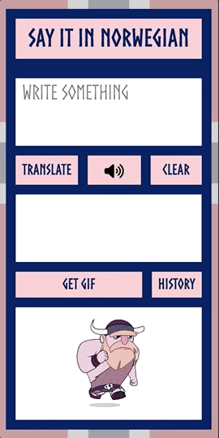

# Say It in Norwegian!
A translation app that takes in English text and translates it to Norwegian, generates a GIF based on the text, with the option of reading the Norwegian translation out loud. It is built with Imba, Node.js, and Express, and powered by OpenAI, ResponsiveVoice TTS API, and giphy.com API. 

## In This Document:
  
  - [Live Application URL](#live-application-url)
  - [Repositories](#repositories)
  - [How to Install the App on Your Smart Phone](#how-to-install-the-app-on-your-smart-phone)
  - [How to Use the Application](#how-to-use-the-application)
    - [Home Page](#home-page)
    - [History Page](#history-page)
  - [Technologies Used](#technologies-used)
  - [Future Features](#future-features)
  - [Challenges and Learning Points](#challenges-and-learning-points)

## Live Application URL
[https://sayitinnorwegian.netlify.app/](https://sayitinnorwegian.netlify.app/)

## Repositories
1. [Client Repository](https://github.com/shantdashjian/say-it-in-norwegian-client)
2. [Server Repository](https://github.com/shantdashjian/say-it-in-norwegian-server)
   
## How to Install the App on Your Smart Phone
This is a [Progressive Web App](https://developer.mozilla.org/en-US/docs/Web/Progressive_web_apps), designed to provide a native app user experience.
1. In your browser, navigate to [the site](https://sayitinnorwegian.netlify.app/) on your smart phone.
2. At the bottom right corner of your browser page, click on the hamburger icon.
3. From the options, click on "Add page to" and select "Home screen".
4. A pop up should appear verifying that you want to add to the Home screen.
5. Select "Add".
6. A shortcut to the app should get added to your Home screen with the Viking icon.
7. To open the app next time, go to your Home screen and click on the Viking icon.

## How to Use the Application
### Home Page
1. A traveller to Norway opens the app.
2. The traveller writes the phrase in English.
3. The traveller clicks on Translate.
4. The app should show the translation in Norwegian.
6. The traveller can click on the Speak button and the app should read the translation out loud.
5. The traveller can click on Get GIF and it should display a relevant GIF.
7. The traveller can click on Clear to clear the input area and start over.
   
### History Page
1. The traveller clicks on the History button.
2. The History page should open.
3. There the traveller can see past translations, with the most recent at the top.
4. The traveller could highlight a translation by clicking anywhere in the translation text or GIF.
5. The traveller could delete a translation from history by clicking on the trash can icon.
6. The traveller could go back to the Home page.

## Technologies Used
1. [Imba](https://imba.io/) for full stack development.
2. [Node.js](https://nodejs.org/en) and [Express](https://expressjs.com/) for the backend.
3. [OpenAI API](https://platform.openai.com/docs/introduction/overview) for generating the translation.
5. [ResponsiveVoice API](https://responsivevoice.org/) for generating the TTS (Text to Speech).
6. [giphy.com API](https://developers.giphy.com/) for generating GIFs from the text.
8. [Progressive Web Apps methodology](https://developer.mozilla.org/en-US/docs/Web/Progressive_web_apps) for native app user experience.

## Future Features
1. Personalize the app by letting the users sign up and login to the app, thus have their translations history persist and be available for them anywhere they open the app.
2. The traveller can speak English into the app and the app would capture it in writing and do the translation to Norwegian automatically. 

## Challenges and Learning Points
1. This is the first full stack app I built using Imba. I enjoyed using Imba to replace HTML, CSS, JavaScript, plus a framework like React. It takes time to get used to using the CSS shorthands, but after a while, I realized how it helped improve my productivity.

[Up](README.md)
